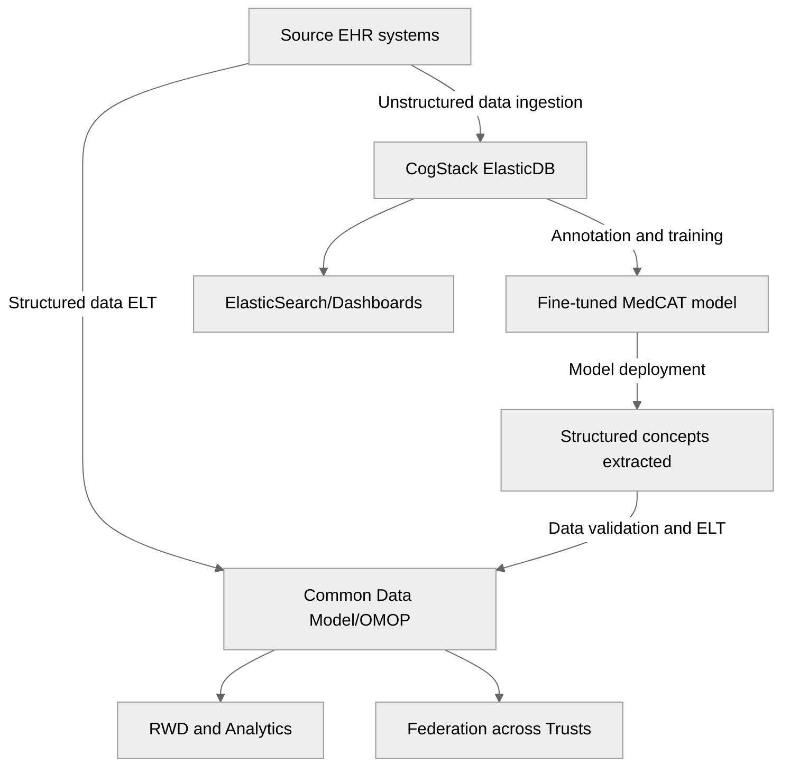
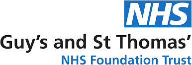
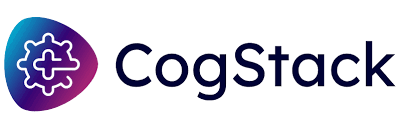

# CogStack for RWD and analytics

## Introduction

CogStack is a full stack unstructured Electronic Health Record (EHR) data mining and [language AI platform](https://cogstack.org), currently deployed across multiple NHS Trusts. This platform performs a key role in EHR data enrichment for the London Secure Data Environment, and across numerous other research programmes.

## Platform

Modular components form an end-to-end unstructured data pipeline: (1) Source unstructured data (letters, reports, clinical notes) are ingested, and free text is extracted from different document formats and stored in Elastic (CogStack ElasticDB);(2) Inverted indices allow free-text queries across the entire hospital unstructured record and visualisation using Kibana (CogStack ElasticSearch); (3) An annotation interface allows concepts within documents to be annotated by a human to standardised clinical vocabulary terms such as SNOMED-CT, and for natural language processing (NLP) models (e.g. MedCAT model) or language AI models to be trained for concept extraction (MedCAT Trainer).




Where the platform is deployed, it supports an extensive and diverse seletion of clinical research, bespoke analytics products, and operational support tools (such as automated clinical coding). 

## RWD and analytics

As infrastructure for structured EHR data extraction scales across the NHS, the vital missing component is an ability to systematically surface concepts from the unstructured record. These concepts fill in missing data gaps to provide a high fidelity representation of patients, enabling more precise analysis, better predictive models, and Real-World Data (RWD) that are essential for life sciences research and clinical trial recruitment.

## Workshops 2024 Q2

To enable scaling of RWD/analytics-as-a-service across the regional ecosystem, the Guy's and St. Thomas' Hospital and London AI Centre teams hosted internal gap analysis workshops, aiming to refine and design processes to support future use-cases. These are documented in ```/workshops```. 

<a href="https://www.aicentre.co.uk/"></a> <a href="https://www.guysandstthomas.nhs.uk/"></a>

<a href="https://cogstack.org/"></a>


