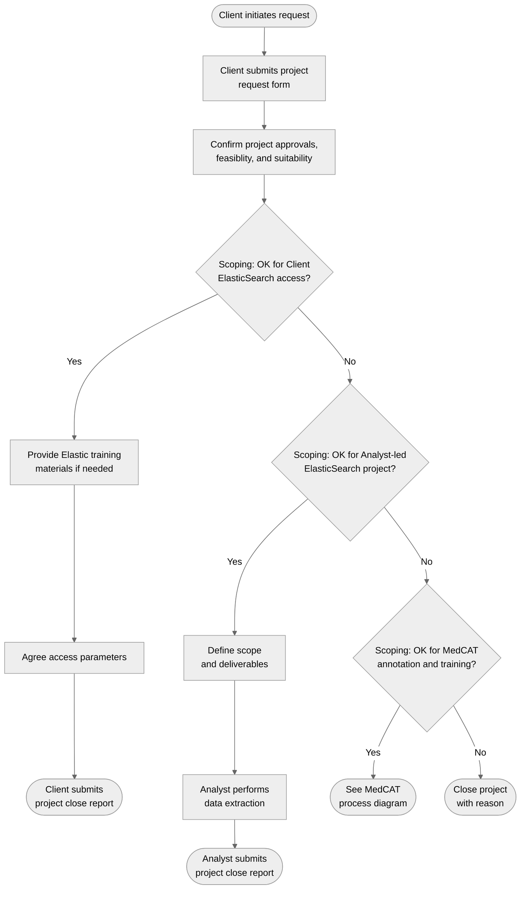

# Project initiation

An end-user ('Client') submits a request for data and/or analytics to CogStack team member ('Analyst').

## Process diagram

## Workshop outcomes

### Request form

* Compulsory requirements:
  * Specific clinical contact as project owner
  * Confirm governance and ethics approvals
  * Confirm that request requires unstructured data
  * Confirm no patient data in form
* Broad project description:
  * Project title
  * Background
  * Aims
  * Method
  * Output
  * Timelines
  * Grant funded? (Explicit ask for grant allocation to CogStack team)
  * Will data be used in commercial revenue  
* Desired deliverable(s):
  * List of patients, or dataset
  * Description of inclusion criteria for patients
    * Temporal inclusion? Including whether future data required
  * If dataset, description of data items required
  * Specific source system of interest (optional - no guessing!)

### Project scoping

* Review of initial requirements:
  * Approvals - correct governance and ethics, nominated clinical sponsor or other Client with project ownership
  * Feasibility - the project is achievable given deliverables, deadlines, and resource availability
  * Suitability - the project is suitable for the CogStack team to deliver, vs other more suitable providers
* Examples of use-cases with Client direct access to ElasticSearch:
  * Perform an audit that can be facilitated by free text search across unstructured records
* Examples of use-cases with Analyst-led ElasticSearch (non-MedCAT):
  * Output as list of patients: Patient inclusion requires a complex search beyond Client capacity or capability
  * Patient inclusion based on unstructured search, but requires linkage to structured data from OMOP DB for final dataset
* Examples of use-cases with MedCAT annotation and training:
  * Dataset derived from unstructured data
  * Dataset derived from unstructured linked to structured data

### Project registration and tracking

* Initial project registration
  * Central / cloud-hosted for portability and cross-site visibility
  * Review all submissions for PID
  * Structured database backend
  * Project ID + project title linked to progress tracking
  * Linking project registrations from multiple sites
* Project updates
  * All updates as free text append to original project registration
  * Close form to end/archive project and summarise impacts
* Project status
  * Kanban board tracking across stages
  * Open and closed project dashboard

### Other

* Consider specific applications for longer term access to Elastic, to support clinical work, or _non-commercial_ audit use-cases
* Future offering of analytics and reporting, dashboard products, and live monitoring 'Watcher job' as service 
* Clear funding model. Proposal: Grant-funded research projects that require data from CogStack (and also OMOP) should contribute towards revenue pot
* Elastic should not be used to curate commercial datasets 