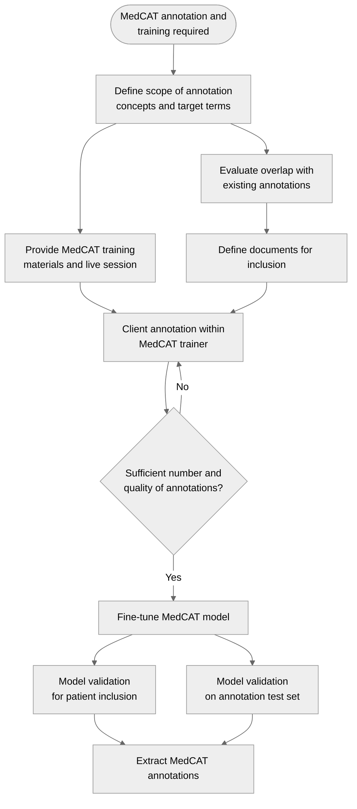

# MedCAT process

A project requires the extraction of concepts from unstructured data, into a structured form, potentially with linkage to other structured data assets.

## Process diagram

## Workshop outcomes

### Initial annotation/document review and set-up 
* Annotation index as dashboard:
  * Potential to pass entire index for visualisation
  * What is depth of human annotation across different clinical domains / SNOMED code areas?
  * What is depth along tree level
  * What is gap for each project?
* Initial scoping searches on Elastic between Client and Analyst
* From jupyter notebook to app-based setup:
  * Move to a webapp for project set up?
  * Build queries, select and pass into MedCAT trainer
  * Queries saved to library 

### User training
* Upgrading training:
  * Update to written materials - process driven
  * New video recordings?

### Model registration and lineage 
* Enabling lineage 
  * Per project annotations assigned ID (or set of IDs)
  * Attach to model IDs
  * Possible for all projects to feed into model registry
  * Host registry in cloud (cross-site)  

### Validation
* Validation based on patient-level outcome recorded as model metadata
* After human annotation in project, ?keep test set of documents
  * Introduce routine per-concept annotation validation
  * Introduce negative document samples for false positive rate